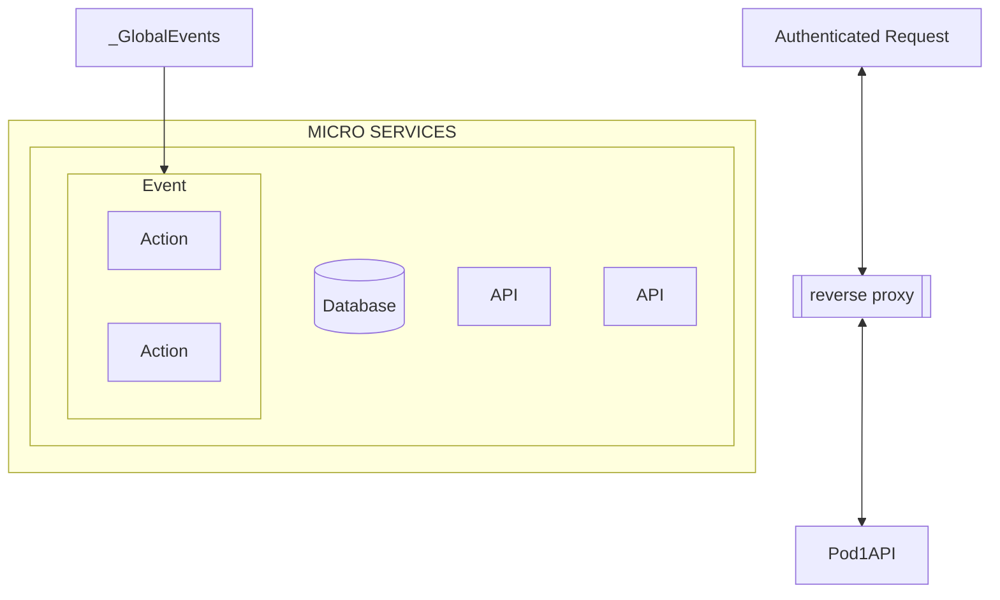

```mermaid
flowchart TD;
  ingress[Authenticated Request]
  ingress <--> proxy[[reverse proxy]]
  proxy <--> Pod1API
  
  subgraph _SERVICES[MICRO SERVICES]
  
	  
	subgraph Pod1[ ]

		Pod1DB[(Database)]
		Pod1Container1[API]
		Pod1Container2[API]
		
		subgraph Pod1Event[Event]
			direction LR
			First[Action]
			Second[Action]
		  end
	  end
  end

  _GlobalEvents --> Pod1Event
```
